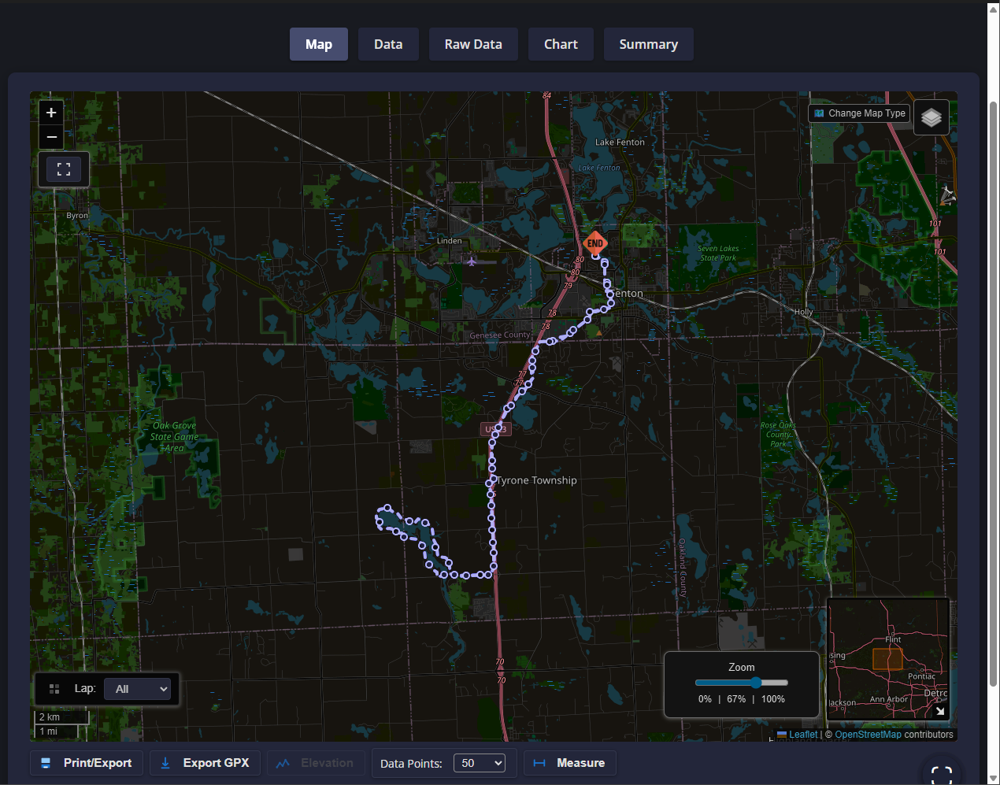
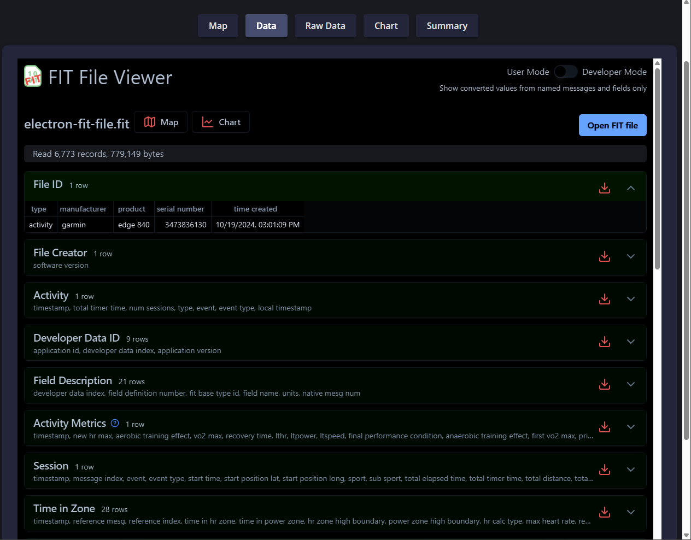
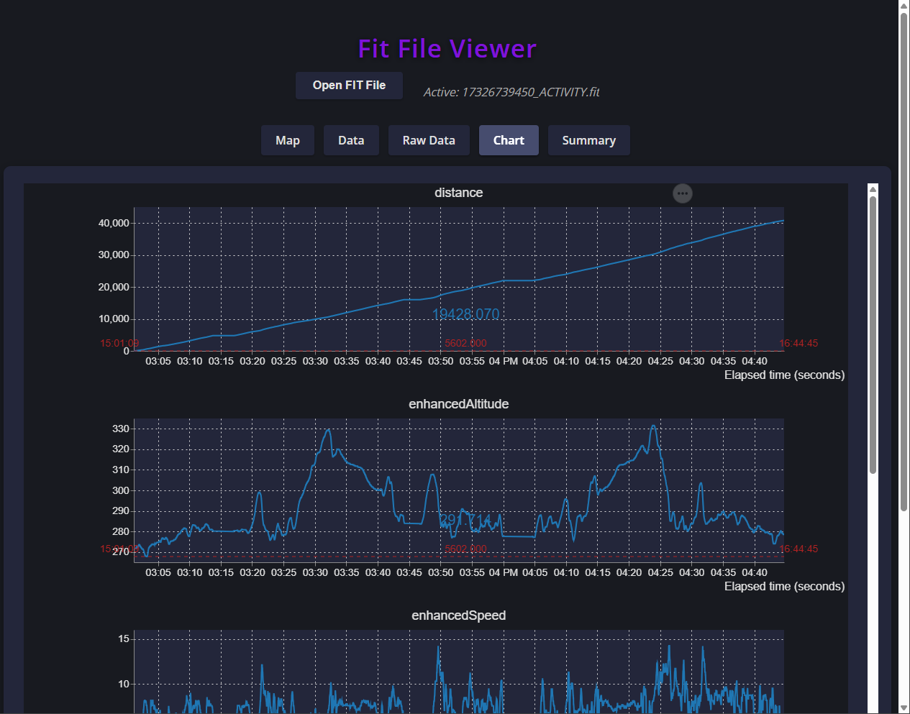

[](https://github.com/Nick2bad4u/FitFileViewer/actions/workflows/ActionLint.yml)
[](https://github.com/Nick2bad4u/FitFileViewer/actions/workflows/Build.yml)
[](https://github.com/Nick2bad4u/FitFileViewer/actions/workflows/codeql.yml)
[](https://github.com/Nick2bad4u/FitFileViewer/actions/workflows/dependabot/dependabot-updates)
[](https://github.com/Nick2bad4u/FitFileViewer/actions/workflows/dependency-review.yml)
[](https://github.com/Nick2bad4u/FitFileViewer/actions/workflows/Build.yml)
[](https://github.com/Nick2bad4u/FitFileViewer/actions/workflows/eslint.yml)
[](https://github.com/Nick2bad4u/FitFileViewer/actions/workflows/sitemap.yml)
[](https://github.com/Nick2bad4u/FitFileViewer/actions/workflows/stale.yml)
[](https://github.com/Nick2bad4u/FitFileViewer/actions/workflows/defender.yml)
[](https://github.com/Nick2bad4u/FitFileViewer/actions/workflows/ossar.yml)
[](https://github.com/Nick2bad4u/FitFileViewer/actions/workflows/osv-scanner.yml)
[](https://github.com/Nick2bad4u/FitFileViewer/actions/workflows/pages/pages-build-deployment)
[](https://github.com/Nick2bad4u/FitFileViewer/actions/workflows/scorecards.yml)

# Fit File Viewer README

Open `.fit` files and visualize their data using maps, tables, and charts. This standalone application provides an intuitive interface for exploring `.fit` file data.







## How to Install

1. Download the latest release from the [Releases Page](https://github.com/Nick2bad4u/FitFileViewer/releases).
2. Extract the downloaded archive.
3. Run the executable file to launch the application.

## How to Use

1. Open the application.
2. Drag and drop a `.fit` file into the application window.
3. Explore the data using the provided maps, tables, and charts.

## Development

To set up the development environment:

```bash
rm -rf node_modules out
npm install
npm run compile
npm run package
```

To build the standalone application:

```bash
npm run build
```

## Credits

This project uses the following libraries and tools:

- [Electron](https://www.electronjs.org/) (MIT license)
- [ThomasCamminady](https://github.com/thomascamminady/fit-viewer) (MIT license)
- <a href="https://www.FitFileViewer.com/" class="italic ms-2 "><span> FitFileViewer.com</span></a>
- <a href="https://www.harryonline.net/" class="italic ms-2 "><span> HarryOnline</span></a>
- [Garmin FIT JavaScript SDK](https://github.com/garmin/fit-javascript-sdk) (FIT Protocol License Agreement - This project complies with the terms of the FIT Protocol License Agreement.)
- [Leaflet.js](https://leafletjs.com) (BSD-2-Clause license)
- [Vega-Lite](https://vega.github.io/vega-lite/) (BSD-3-Clause license)
- [Vega-Embed](https://github.com/vega/vega-embed) (BSD-3-Clause license)
